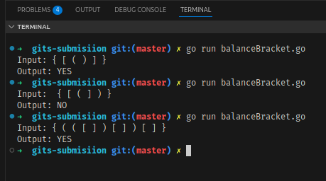

# A000124 of Sloane's OEIS - Problem Solving

Soal ini meminta untuk menghasilkan urutan angka berdasarkan rumus **A000124** dari *OEIS*. Urutan dimulai dari angka 1, dan setiap angka berikutnya dihitung dengan menambahkan angka yang bertambah secara bertahap.

### Contoh:
- **Input**: 7
- **Output**: 1-2-4-7-11-16-22

## Pendekatan
1. **Iteratif**
2. **Rekursif**

## Screenshot Output

# Dense Ranking - Problem Solving

Dense Ranking adalah konsep yang membuat kondisi ketika beberapa pemain memiliki skor yang sama maka mereka akan mendapatkan peringkat yang sama. 
    
### Contoh:
- **Input**: 

7

100 100 50 40 40 20 10 

4

5 25 50 120

- **Output**: 6 4 2 1

## Screenshot Output

# Balanced Bracket - Problem Solving
Balanced Bracket merupakan masalah untuk memeriksa apakah suatu string yang berisi bracket bracket memiliki pasangan yang seimbang antara bracket buka dan bracket tutup.
### Contoh:

Input: {[()]}
Output: YES
Penjelasan: Setiap bracket seimbang, antara bracket buka dan bracket tutup.
Input: {[(])}
Output: NO
Penjelasan: String {[(])} tidak seimbang untuk karakter yang diapit oleh ( dan ) yaitu [().
Input: {(([])[])[]}
Output: YES
Penjelasan: Setiap bracket seimbang, antara bracket buka dan bracket tutup, meskipun struktur bracket tidak beraturan.

## Pendekatan

- Menggunakan struktur data stack untuk melacak bracket yang dibuka
- Memeriksa kecocokan antara bracket buka dan bracket tutup
- Mengabaikan whitespace saat pemeriksaan

## Kompleksitas

- Time Complexity: O(n) di mana n adalah panjang string input
    -  Kita hanya perlu mengiterasi melalui string satu kali
    -  Operasi push dan pop pada stack memiliki kompleksitas waktu O(1)

## Screenshot Output
